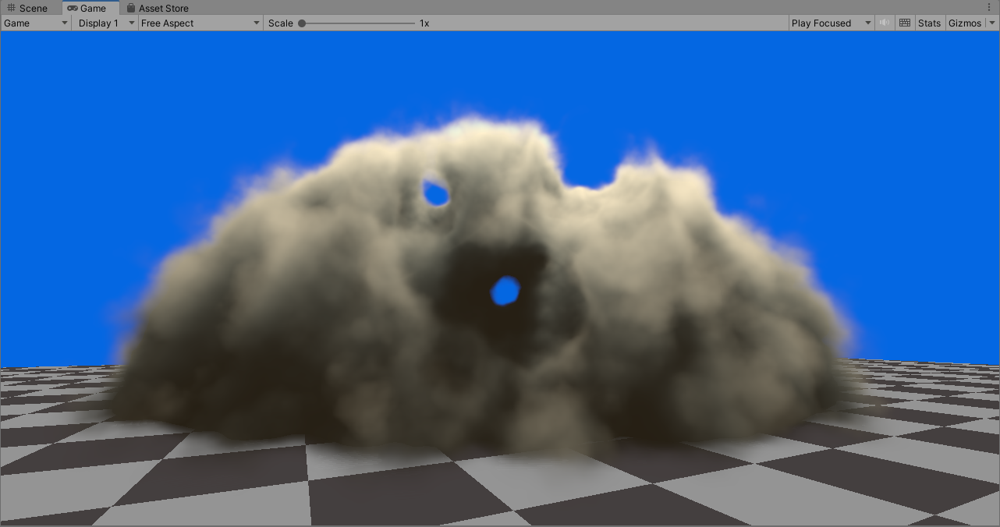

# Counter Strike 2 Smoke Grenades

by Garrett Gunnell

This is the code associated with my video explaining the implementation [here](https://www.youtube.com/watch?v=ryB8hT5TMSg&ab_channel=Acerola)

## Disclaimer

This is not a production ready asset. Please do not use it as a production ready asset. 

## Features

* Voxel Based Propagation (Limited Flood Fill)
* Mesh Voxelizer
* Generalized Volume Ray Marcher
* Tiled Worley Noise Generator
* SDF Based Smoke Deformation (Not Performant)

## Examples

